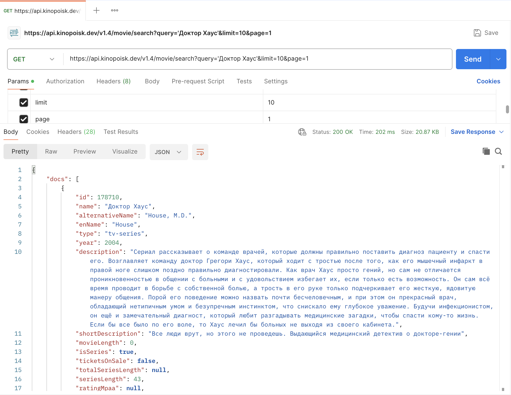
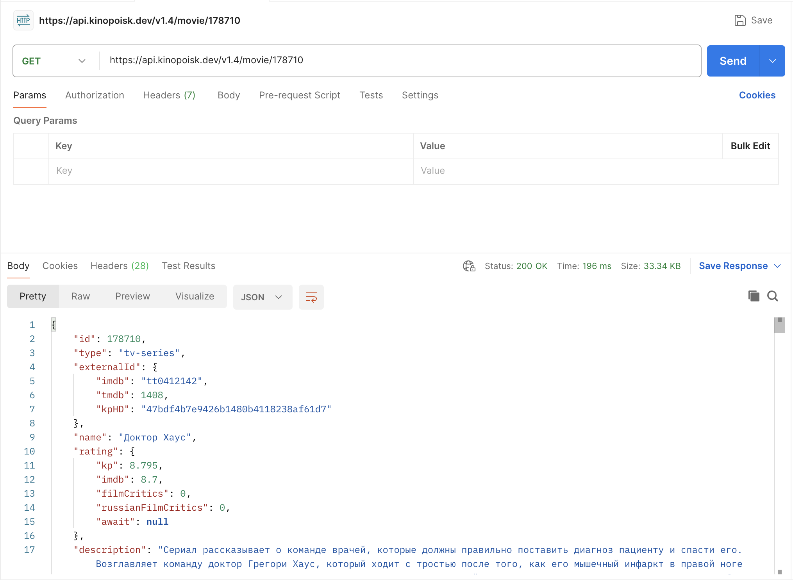
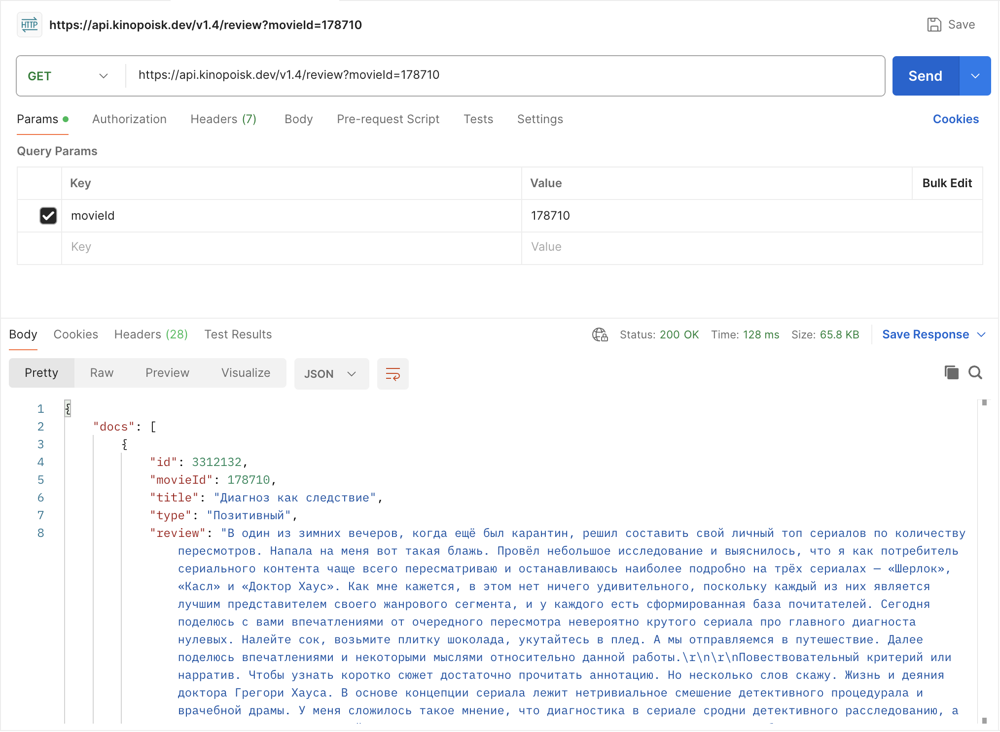
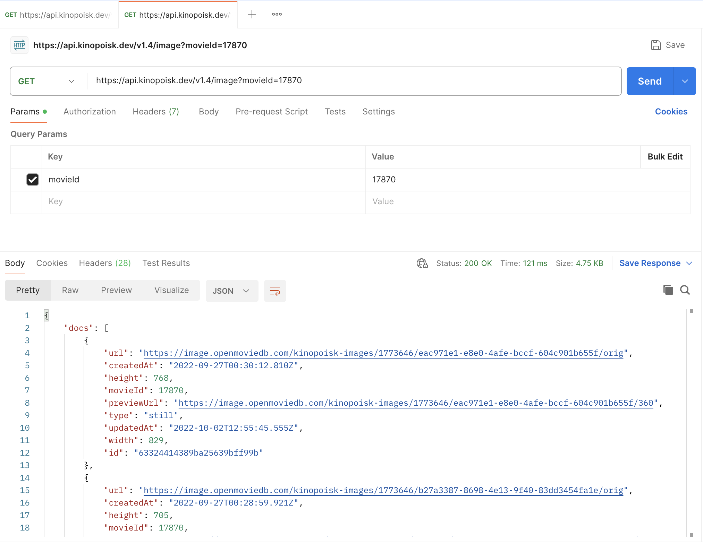
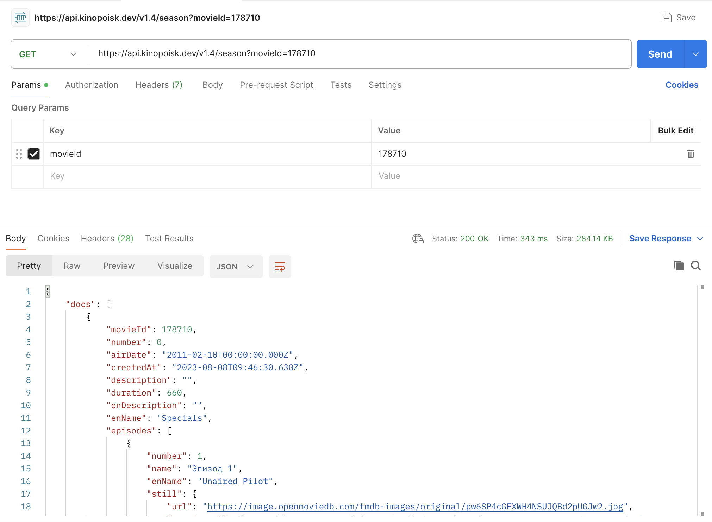

# Тестовое задание в Авито

## Стек технологий
* фронтенд фреймворк: React, версия 18;
* Библиотека компонентов: ant.design;
* Сборщик: Webpack
* Пакетный менеджер: npm

## Запуск проекта в режиме разработчика

### `TOKEN=<your api token> npm run start`
Проект доступен по ссылке <http://localhost:7070>

## Также доступна возможность запустьтить проект в Docker

### `docker-compose build && docker-compose up`

## Примеры запросов и ответов

### Запрос на поиск фильмов по названию
 

### Запрос на данных о фильме
 

### Запрос на получение отзывов о фильме
 

### Запрос на получение постеров фильма
 

### Запрос на получение сезонов серила
 
